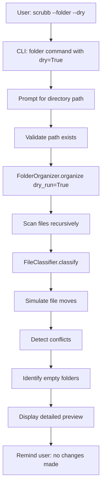

# Design Document: Dry-Run Mode for Folder Cleanup

## Overview

The dry-run mode extends the folder cleanup feature with a preview capability. When invoked with `scrubb --folder --dry`, the system will:

1. Analyze all files in the target directory tree
2. Simulate the categorization and organization process
3. Detect potential conflicts and issues
4. Display detailed information about what would happen
5. Make no actual changes to the file system

This feature allows users to verify the cleanup behavior before committing to changes, providing confidence and transparency in the operation.

## Architecture

The dry-run mode will be implemented as an extension to the existing folder cleanup functionality. The architecture maintains separation between simulation and execution:

```
scrubb/
  cli.py              # Add --dry flag to folder command
  folder_organizer.py # Add dry_run parameter and simulation logic
  file_classifier.py  # Existing (no changes needed)
```

### Component Interaction Flow



## Components and Interfaces

### 1. CLI Command Updates (`cli.py`)

Add `--dry` flag to the existing `folder` command:

```python
@app.command()
def folder(
    dry: bool = typer.Option(False, "--dry", help="Preview changes without executing them")
):
    """Organize files into categorized folders and remove empty directories."""
    if dry:
        typer.secho("\n DRY RUN MODE - No changes will be made\n", fg=typer.colors.YELLOW, bold=True)
    
    # Existing path prompt and validation
    # Pass dry_run parameter to FolderOrganizer
    # Display appropriate output based on mode
```

### 2. DryRunStats Data Model

Extended statistics for dry-run mode:

```python
@dataclass
class DryRunStats:
    # Basic stats (same as OrganizationStats)
    files_to_move: int = 0
    files_by_category: Dict[str, int] = field(default_factory=dict)
    empty_folders_to_remove: int = 0
    
    # Additional dry-run information
    file_operations: List[FileOperation] = field(default_factory=list)
    directories_to_create: List[Path] = field(default_factory=list)
    directories_to_remove: List[Path] = field(default_factory=list)
    conflicts: List[ConflictInfo] = field(default_factory=list)
    skipped_files: List[SkippedFile] = field(default_factory=list)
    potential_errors: List[str] = field(default_factory=list)

@dataclass
class FileOperation:
    source: Path
    destination: Path
    category: FileCategory
    is_conflict: bool = False
    resolved_name: str = None

@dataclass
class ConflictInfo:
    original_name: str
    resolved_name: str
    category: str
    destination_path: Path

@dataclass
class SkippedFile:
    path: Path
    reason: str
```

### 3. FolderOrganizer Updates (`folder_organizer.py`)

Add dry-run capability to the existing class:

```python
class FolderOrganizer:
    def __init__(self, root_path: Path, classifier: FileClassifier, dry_run: bool = False):
        self.root_path: Path
        self.scrubbed_path: Path
        self.classifier: FileClassifier
        self.dry_run: bool = dry_run
        self.stats: Union[OrganizationStats, DryRunStats]
    
    def organize(self) -> Union[OrganizationStats, DryRunStats]:
        """Main entry point - behavior changes based on dry_run flag."""
        if self.dry_run:
            return self._organize_dry_run()
        else:
            return self._organize_actual()
    
    def _organize_dry_run(self) -> DryRunStats:
        """Simulate organization and collect detailed information."""
        stats = DryRunStats()
        
        # Scan files (read-only operation)
        files = self._scan_files()
        
        # Simulate each operation
        for file_path in files:
            category = self.classifier.classify(file_path)
            
            if category == FileCategory.UNKNOWN:
                stats.skipped_files.append(SkippedFile(file_path, "Unknown extension"))
                continue
            
            # Simulate destination path and conflict detection
            dest_path = self._simulate_destination(file_path, category)
            is_conflict = self._would_conflict(dest_path)
            
            if is_conflict:
                resolved_path = self._simulate_conflict_resolution(dest_path)
                stats.conflicts.append(ConflictInfo(...))
                dest_path = resolved_path
            
            # Record operation
            stats.file_operations.append(FileOperation(file_path, dest_path, category, is_conflict))
            stats.files_to_move += 1
            stats.files_by_category[category.value] = stats.files_by_category.get(category.value, 0) + 1
            
            # Track directories that would be created
            if dest_path.parent not in stats.directories_to_create:
                stats.directories_to_create.append(dest_path.parent)
        
        # Identify empty directories that would be removed
        stats.directories_to_remove = self._identify_empty_directories()
        stats.empty_folders_to_remove = len(stats.directories_to_remove)
        
        # Check for potential errors
        stats.potential_errors = self._check_potential_errors(files)
        
        return stats
    
    def _organize_actual(self) -> OrganizationStats:
        """Existing actual organization logic."""
        # Current implementation remains unchanged
        pass
    
    def _simulate_destination(self, file_path: Path, category: FileCategory) -> Path:
        """Calculate where file would be moved."""
        category_path = self.scrubbed_path / category.value
        return category_path / file_path.name
    
    def _would_conflict(self, dest_path: Path) -> bool:
        """Check if destination would conflict (in simulation context)."""
        # Check both actual file system and simulated operations
        pass
    
    def _simulate_conflict_resolution(self, dest_path: Path) -> Path:
        """Simulate conflict resolution without creating files."""
        # Use same logic as _handle_name_conflict but don't check file system
        pass
    
    def _identify_empty_directories(self) -> List[Path]:
        """Identify directories that would become empty."""
        # Simulate which directories would be empty after moves
        pass
    
    def _check_potential_errors(self, files: List[Path]) -> List[str]:
        """Check for potential issues that might occur."""
        errors = []
        for file_path in files:
            try:
                # Check read permissions
                file_path.stat()
            except PermissionError:
                errors.append(f"Permission denied: {file_path}")
            except Exception as e:
                errors.append(f"Error accessing {file_path}: {str(e)}")
        return errors
```

### 4. Output Formatting

Create a dedicated formatter for dry-run output:

```python
class DryRunFormatter:
    @staticmethod
    def format_output(stats: DryRunStats, root_path: Path) -> str:
        """Format dry-run statistics into readable output."""
        output = []
        
        # Header
        output.append("\n" + "="*70)
        output.append("DRY RUN PREVIEW - No changes will be made")
        output.append("="*70 + "\n")
        
        # Summary statistics
        output.append(" SUMMARY")
        output.append(f"  Files to move: {stats.files_to_move}")
        output.append(f"  Directories to create: {len(stats.directories_to_create)}")
        output.append(f"  Empty directories to remove: {stats.empty_folders_to_remove}")
        output.append(f"  Files to skip: {len(stats.skipped_files)}")
        output.append(f"  Potential conflicts: {len(stats.conflicts)}")
        
        # Files by category
        if stats.files_by_category:
            output.append("\n FILES BY CATEGORY")
            for category, count in sorted(stats.files_by_category.items()):
                output.append(f"  {category}: {count} files")
        
        # Directories to create
        if stats.directories_to_create:
            output.append("\n DIRECTORIES TO CREATE")
            for dir_path in sorted(stats.directories_to_create):
                output.append(f"  {dir_path}")
        
        # File operations (grouped by category)
        if stats.file_operations:
            output.append("\n FILE OPERATIONS")
            by_category = {}
            for op in stats.file_operations:
                cat = op.category.value
                if cat not in by_category:
                    by_category[cat] = []
                by_category[cat].append(op)
            
            for category, operations in sorted(by_category.items()):
                output.append(f"\n  {category}:")
                for op in operations:
                    conflict_marker = " [CONFLICT RESOLVED]" if op.is_conflict else ""
                    output.append(f"    {op.source.name} → {op.destination}{conflict_marker}")
        
        # Conflicts
        if stats.conflicts:
            output.append("\n  NAME CONFLICTS")
            for conflict in stats.conflicts:
                output.append(f"  {conflict.original_name} → {conflict.resolved_name}")
                output.append(f"    Category: {conflict.category}")
        
        # Skipped files
        if stats.skipped_files:
            output.append("\n⏭  SKIPPED FILES")
            for skipped in stats.skipped_files:
                output.append(f"  {skipped.path} - {skipped.reason}")
        
        # Empty directories to remove
        if stats.directories_to_remove:
            output.append("\n  EMPTY DIRECTORIES TO REMOVE")
            for dir_path in sorted(stats.directories_to_remove):
                output.append(f"  {dir_path}")
        
        # Potential errors
        if stats.potential_errors:
            output.append("\n POTENTIAL ERRORS")
            for error in stats.potential_errors:
                output.append(f"  {error}")
        else:
            output.append("\n No potential errors detected")
        
        # Footer
        output.append("\n" + "="*70)
        output.append("This was a DRY RUN - No files were moved or modified")
        output.append("Run without --dry flag to execute these changes")
        output.append("="*70 + "\n")
        
        return "\n".join(output)
```

## Data Models

### DryRunStats

Complete data structure for dry-run information:

```python
@dataclass
class DryRunStats:
    files_to_move: int = 0
    files_by_category: Dict[str, int] = field(default_factory=dict)
    empty_folders_to_remove: int = 0
    file_operations: List[FileOperation] = field(default_factory=list)
    directories_to_create: List[Path] = field(default_factory=list)
    directories_to_remove: List[Path] = field(default_factory=list)
    conflicts: List[ConflictInfo] = field(default_factory=list)
    skipped_files: List[SkippedFile] = field(default_factory=list)
    potential_errors: List[str] = field(default_factory=list)
```

### Supporting Data Classes

```python
@dataclass
class FileOperation:
    source: Path
    destination: Path
    category: FileCategory
    is_conflict: bool = False
    resolved_name: Optional[str] = None

@dataclass
class ConflictInfo:
    original_name: str
    resolved_name: str
    category: str
    destination_path: Path

@dataclass
class SkippedFile:
    path: Path
    reason: str
```


## Correctness Properties

*A property is a characteristic or behavior that should hold true across all valid executions of a system—essentially, a formal statement about what the system should do. Properties serve as the bridge between human-readable specifications and machine-verifiable correctness guarantees.*

### Property 1: No file system modifications in dry-run mode

*For any* dry-run execution, the system should not create directories, move files, or delete directories.

**Validates: Requirements 1.2, 1.3, 1.4**

### Property 2: Complete file operation reporting

*For any* set of files in the target directory, the dry-run output should list all files that would be moved with their source paths and destination categories.

**Validates: Requirements 2.1, 2.2, 2.3**

### Property 3: Accurate statistics reporting

*For any* dry-run execution, the displayed statistics (total files, per-category counts, empty directories) should accurately reflect what would happen in actual execution.

**Validates: Requirements 3.1, 3.2, 3.3, 3.5**

### Property 4: Conflict detection and reporting

*For any* files that would have name conflicts, the dry-run should identify them, show original and resolved names, and group them by category.

**Validates: Requirements 4.1, 4.2, 4.3, 4.4**

### Property 5: Directory creation reporting

*For any* categories that would receive files, the dry-run should list all directories that would be created including the Scrubbed folder and category subdirectories.

**Validates: Requirements 5.1, 5.2, 5.4**

### Property 6: Skipped file reporting

*For any* files with unknown extensions, the dry-run should list them with their paths and reasons for skipping.

**Validates: Requirements 6.1, 6.2, 6.3**

### Property 7: Potential error detection

*For any* files that might be inaccessible, the dry-run should identify and list potential permission issues with an accurate error count.

**Validates: Requirements 8.1, 8.3**

### Property 8: Output organization

*For any* dry-run execution, the output should be organized into clear sections with consistent path formatting throughout.

**Validates: Requirements 9.1, 9.4**

### Property 9: Classification consistency

*For any* file, the dry-run mode should use the same classification logic as actual execution, producing identical categorization results.

**Validates: Requirements 10.1**

### Property 10: Conflict resolution consistency

*For any* name conflict scenario, the dry-run mode should use the same conflict resolution logic as actual execution, producing identical resolved filenames.

**Validates: Requirements 10.2**

### Property 11: Empty directory detection consistency

*For any* directory structure, the dry-run mode should identify the same empty directories that would be removed in actual execution.

**Validates: Requirements 10.3**

### Property 12: Dry-run prediction accuracy (Round-trip property)

*For any* directory structure, if we run dry-run mode followed by actual execution, the actual results should match the dry-run predictions for all operations.

**Validates: Requirements 10.4**

## Error Handling

### Error Categories

1. **Path Validation Errors** (same as actual mode)
   - Non-existent directory path
   - Invalid path format
   - Insufficient permissions to access root directory
   - Action: Display error message and exit with code 1

2. **Permission Check Errors** (dry-run specific)
   - Files that cannot be read
   - Directories that cannot be accessed
   - Action: Add to potential_errors list, continue analysis

3. **Simulation Errors**
   - Unexpected errors during conflict simulation
   - Errors during empty directory identification
   - Action: Log warning, continue with best-effort analysis

### Error Reporting in Dry-Run

Dry-run mode will report two types of errors:

1. **Potential Errors**: Issues that might occur during actual execution
   - Permission denied on files
   - Inaccessible paths
   - Displayed in "POTENTIAL ERRORS" section

2. **Analysis Errors**: Issues during dry-run analysis itself
   - Unexpected exceptions during simulation
   - Displayed as warnings, don't halt execution

### Graceful Degradation

The dry-run mode will continue analysis even when individual files cannot be accessed, providing the most complete preview possible. Only critical errors (invalid root path) will halt execution.

## Testing Strategy

### Unit Testing

Unit tests will verify specific dry-run behaviors:

1. **Dry-Run Mode Activation**
   - Test that --dry flag activates dry-run mode
   - Test that dry-run mode displays appropriate headers/footers
   - Test that no file system changes occur

2. **Statistics Collection**
   - Test that DryRunStats captures all required information
   - Test file operation recording
   - Test conflict detection and recording
   - Test skipped file recording

3. **Output Formatting**
   - Test DryRunFormatter produces correct sections
   - Test grouping of operations by category
   - Test conflict information display
   - Test potential error display

4. **Simulation Logic**
   - Test destination path calculation
   - Test conflict detection without file system changes
   - Test empty directory identification

### Property-Based Testing

Property-based tests will verify universal properties using the **Hypothesis** library for Python. Each test will run a minimum of 100 iterations.

1. **Property 1: No file system modifications in dry-run mode**
   - Generate random directory structures with files
   - Run dry-run mode
   - Verify no directories created, no files moved, no directories deleted
   - Tag: **Feature: dry-run-mode, Property 1: No file system modifications in dry-run mode**

2. **Property 2: Complete file operation reporting**
   - Generate random file sets with various extensions
   - Run dry-run mode
   - Verify all moveable files are listed in output
   - Tag: **Feature: dry-run-mode, Property 2: Complete file operation reporting**

3. **Property 3: Accurate statistics reporting**
   - Generate random directory structures
   - Run dry-run mode
   - Verify statistics match expected counts
   - Tag: **Feature: dry-run-mode, Property 3: Accurate statistics reporting**

4. **Property 4: Conflict detection and reporting**
   - Generate files with duplicate names
   - Run dry-run mode
   - Verify all conflicts are detected and reported correctly
   - Tag: **Feature: dry-run-mode, Property 4: Conflict detection and reporting**

5. **Property 5: Directory creation reporting**
   - Generate files requiring various categories
   - Run dry-run mode
   - Verify all necessary directories are listed
   - Tag: **Feature: dry-run-mode, Property 5: Directory creation reporting**

6. **Property 6: Skipped file reporting**
   - Generate files with unknown extensions
   - Run dry-run mode
   - Verify all skipped files are listed with reasons
   - Tag: **Feature: dry-run-mode, Property 6: Skipped file reporting**

7. **Property 7: Potential error detection**
   - Generate files with simulated permission issues
   - Run dry-run mode
   - Verify potential errors are detected and reported
   - Tag: **Feature: dry-run-mode, Property 7: Potential error detection**

8. **Property 8: Output organization**
   - Generate various directory structures
   - Run dry-run mode
   - Verify output contains required sections
   - Tag: **Feature: dry-run-mode, Property 8: Output organization**

9. **Property 9: Classification consistency**
   - Generate random files with various extensions
   - Compare classification in dry-run vs actual mode
   - Verify identical results
   - Tag: **Feature: dry-run-mode, Property 9: Classification consistency**

10. **Property 10: Conflict resolution consistency**
    - Generate files with name conflicts
    - Compare conflict resolution in dry-run vs actual mode
    - Verify identical resolved names
    - Tag: **Feature: dry-run-mode, Property 10: Conflict resolution consistency**

11. **Property 11: Empty directory detection consistency**
    - Generate directory structures that become empty
    - Compare empty directory detection in dry-run vs actual mode
    - Verify identical directory lists
    - Tag: **Feature: dry-run-mode, Property 11: Empty directory detection consistency**

12. **Property 12: Dry-run prediction accuracy**
    - Generate random directory structures
    - Run dry-run mode to get predictions
    - Run actual mode on a copy
    - Verify actual results match dry-run predictions
    - Tag: **Feature: dry-run-mode, Property 12: Dry-run prediction accuracy**

### Testing Framework

- **Unit Tests**: pytest
- **Property-Based Tests**: Hypothesis (pytest plugin)
- **Test Configuration**: Each property test will run 100 iterations minimum
- **Test Location**: `tests/test_dry_run.py`

### Test Utilities

Reuse existing test utilities and add dry-run specific helpers:
- `create_test_directory_structure()`: Generate temporary directory trees (existing)
- `create_test_files()`: Generate files with specific extensions (existing)
- `compare_dry_run_to_actual()`: Compare dry-run predictions with actual results
- `verify_no_changes()`: Verify file system unchanged after dry-run
- `parse_dry_run_output()`: Extract information from dry-run output for verification

## Implementation Notes

### Reusing Existing Logic

The dry-run mode will reuse as much existing logic as possible:
- File scanning: Use existing `_scan_files()` method
- Classification: Use existing `FileClassifier.classify()` method
- Conflict resolution logic: Extract into reusable method used by both modes
- Empty directory detection: Extract into reusable method used by both modes

### Simulation State Management

Dry-run mode needs to track simulated state:
- Maintain a set of "simulated destinations" to detect conflicts
- Track which directories would be created
- Track which directories would become empty

### Output Verbosity

Dry-run mode provides more detailed output than actual execution:
- Actual mode: Concise summary for quick execution
- Dry-run mode: Detailed breakdown for thorough review

### Performance Considerations

Dry-run mode should be fast since it doesn't perform I/O operations:
- No file moves (major time saver)
- No directory creation/deletion
- Only read operations for scanning and permission checks

### Path Display

Use relative paths in output when possible for readability, with option to show absolute paths for clarity.

## Future Enhancements

Potential future improvements (not in current scope):

1. JSON output format for programmatic consumption
2. Diff-style output showing before/after structure
3. Interactive mode to selectively approve/reject operations
4. Save dry-run results to file for later reference
5. Compare multiple dry-run scenarios
6. Estimate disk space changes
7. Estimate operation time based on file sizes
