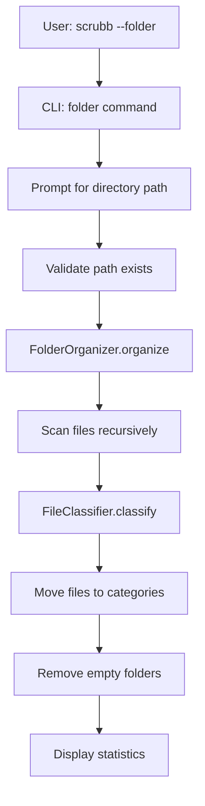

# Design Document: Folder Cleanup Feature

## Overview

The folder cleanup feature extends the scrubb CLI tool with file organization capabilities. When invoked with the `--folder` flag, the system will:

1. Prompt the user for a target directory path
2. Recursively scan all files in that directory tree
3. Categorize files by type (Images, Video, Docs, Development)
4. Move files to organized subdirectories within a "Scrubbed" folder
5. Remove all empty directories as a final cleanup step

This feature operates independently from the emoji scrubbing functionality and provides users with a simple way to organize cluttered directories.

## Architecture

The folder cleanup feature will be implemented as a new command in the existing Typer CLI application. The architecture follows the established pattern in scrubb:

```
scrubb/
  cli.py              # Add new 'folder' command
  folder_organizer.py # New module for folder cleanup logic
  file_classifier.py  # New module for file type classification
  config.py           # Existing (no changes needed)
  ignore.py           # Existing (no changes needed)
```

### Component Interaction Flow



## Components and Interfaces

### 1. CLI Command (`cli.py`)

Add a new `folder` command to the existing Typer app:

```python
@app.command()
def folder():
    """Organize files into categorized folders and remove empty directories."""
    # Prompt for directory path
    # Validate path
    # Create FolderOrganizer instance
    # Execute organization
    # Display statistics
```

### 2. FileClassifier (`file_classifier.py`)

Responsible for determining file categories based on extensions.

```python
class FileCategory(Enum):
    IMAGE = "Images"
    VIDEO = "Video"
    MARKDOWN = "Docs/Markdown"
    DOCUMENT = "Docs/Other Docs"
    DEVELOPMENT = "Development"
    UNKNOWN = None

class FileClassifier:
    def __init__(self):
        self.image_extensions: set[str]
        self.video_extensions: set[str]
        self.markdown_extensions: set[str]
        self.document_extensions: set[str]
        self.development_extensions: set[str]
    
    def classify(self, file_path: Path) -> FileCategory:
        """Classify a file based on its extension."""
        pass
```

### 3. FolderOrganizer (`folder_organizer.py`)

Orchestrates the file organization and cleanup process.

```python
class OrganizationStats:
    files_moved: int
    files_by_category: Dict[FileCategory, int]
    empty_folders_removed: int
    errors: int
    error_files: List[str]

class FolderOrganizer:
    def __init__(self, root_path: Path, classifier: FileClassifier):
        self.root_path: Path
        self.scrubbed_path: Path  # root_path / "Scrubbed"
        self.classifier: FileClassifier
        self.stats: OrganizationStats
    
    def organize(self) -> OrganizationStats:
        """Main entry point for organization process."""
        pass
    
    def _scan_files(self) -> List[Path]:
        """Recursively find all files in root_path."""
        pass
    
    def _move_file(self, file_path: Path, category: FileCategory) -> bool:
        """Move a file to its category folder, handling conflicts."""
        pass
    
    def _handle_name_conflict(self, dest_path: Path) -> Path:
        """Generate a unique filename if conflict exists."""
        pass
    
    def _remove_empty_folders(self) -> int:
        """Remove all empty directories, return count removed."""
        pass
    
    def _is_empty_directory(self, dir_path: Path) -> bool:
        """Check if directory is empty or contains only empty subdirs."""
        pass
```

## Data Models

### FileCategory Enum

```python
class FileCategory(Enum):
    IMAGE = "Images"
    VIDEO = "Video"
    MARKDOWN = "Docs/Markdown"
    DOCUMENT = "Docs/Other Docs"
    DEVELOPMENT = "Development"
    UNKNOWN = None
```

### OrganizationStats

```python
@dataclass
class OrganizationStats:
    files_moved: int = 0
    files_by_category: Dict[str, int] = field(default_factory=dict)
    empty_folders_removed: int = 0
    errors: int = 0
    error_files: List[str] = field(default_factory=list)
```

### File Extension Mappings

```python
IMAGE_EXTENSIONS = {
    ".jpg", ".jpeg", ".png", ".gif", ".bmp", 
    ".svg", ".webp", ".ico", ".tiff", ".tif"
}

VIDEO_EXTENSIONS = {
    ".mp4", ".avi", ".mov", ".mkv", ".flv",
    ".wmv", ".webm", ".m4v", ".mpeg", ".mpg"
}

MARKDOWN_EXTENSIONS = {
    ".md", ".markdown"
}

DOCUMENT_EXTENSIONS = {
    ".pdf", ".doc", ".docx", ".txt", ".rtf",
    ".odt", ".xls", ".xlsx", ".ppt", ".pptx", ".csv"
}

DEVELOPMENT_EXTENSIONS = {
    ".py", ".js", ".ts", ".jsx", ".tsx", ".java",
    ".c", ".cpp", ".h", ".hpp", ".rs", ".go",
    ".rb", ".php", ".html", ".css", ".scss",
    ".json", ".xml", ".yaml", ".yml", ".toml",
    ".sh", ".bash", ".sql", ".r", ".swift", ".kt"
}
```


## Correctness Properties

*A property is a characteristic or behavior that should hold true across all valid executions of a system—essentially, a formal statement about what the system should do. Properties serve as the bridge between human-readable specifications and machine-verifiable correctness guarantees.*

### Property 1: File categorization correctness

*For any* file with a recognized extension, the system should move that file to the correct category folder based on its extension type.

**Validates: Requirements 3.1, 3.2, 3.3, 3.4, 3.5**

### Property 2: Path resolution consistency

*For any* valid directory path (absolute or relative), the system should correctly resolve and use that path as the root directory for all operations.

**Validates: Requirements 2.1, 2.3**

### Property 3: Category directory creation

*For any* file category that has files to move, the system should create the corresponding category subdirectory if it does not exist.

**Validates: Requirements 3.7**

### Property 4: Name conflict resolution preserves files

*For any* file name conflict in a destination folder, the system should rename the incoming file with a numeric suffix while preserving the file extension, ensuring no files are overwritten.

**Validates: Requirements 4.1, 4.3**

### Property 5: Incremental conflict numbering

*For any* sequence of files with the same name, the system should append incrementing numbers (1, 2, 3, ...) to preserve all files uniquely.

**Validates: Requirements 4.2**

### Property 6: Empty directory removal

*For any* directory that becomes empty after file moves (and is not the root or Scrubbed folder), the system should remove that directory.

**Validates: Requirements 5.1**

### Property 7: Recursive empty directory removal

*For any* directory containing only empty subdirectories (and is not the root or Scrubbed folder), the system should recursively remove all empty subdirectories.

**Validates: Requirements 5.2**

### Property 8: Recursive file discovery

*For any* directory tree structure, the system should discover and process files at all depth levels, regardless of nesting.

**Validates: Requirements 7.1, 7.2**

### Property 9: Directory structure flattening

*For any* file in a nested source directory structure, the system should move it to a flat category folder without preserving the original directory hierarchy.

**Validates: Requirements 7.3**

### Property 10: Error handling continuation

*For any* file that cannot be moved or accessed, the system should log the error, increment the error counter, and continue processing remaining files.

**Validates: Requirements 9.1, 9.2**


## Error Handling

### Error Categories

1. **Path Validation Errors**
   - Non-existent directory path
   - Invalid path format
   - Insufficient permissions to access root directory
   - Action: Display error message and exit with code 1

2. **File Operation Errors**
   - Permission denied when moving file
   - File locked by another process
   - Disk space issues
   - Action: Log error, increment error counter, continue processing

3. **Directory Creation Errors**
   - Permission denied when creating Scrubbed folder
   - Disk space issues
   - Action: Display error message and exit with code 1

4. **Empty Folder Removal Errors**
   - Permission denied when removing directory
   - Directory in use by another process
   - Action: Log warning, continue processing

### Error Reporting

All errors will be accumulated during processing and reported in the final statistics output:

```
Folder cleanup complete:
  Files moved: 42
  Empty folders removed: 8
  Errors: 3

Error files:
  [X] /path/to/locked_file.txt
  [X] /path/to/permission_denied.jpg
  [X] /path/to/inaccessible.pdf
```

### Graceful Degradation

The system will continue processing even when individual files fail, ensuring maximum utility even in the presence of errors. Only critical errors (invalid root path, cannot create Scrubbed folder) will halt execution.

## Testing Strategy

### Unit Testing

Unit tests will verify specific behaviors and edge cases:

1. **FileClassifier Tests**
   - Test classification of each file type category
   - Test handling of files with no extension
   - Test handling of files with unrecognized extensions
   - Test case-insensitive extension matching

2. **FolderOrganizer Tests**
   - Test Scrubbed folder creation
   - Test category subdirectory creation
   - Test file name conflict resolution with various scenarios
   - Test empty folder detection
   - Test protection of root and Scrubbed folders from deletion
   - Test error handling for inaccessible files

3. **CLI Tests**
   - Test folder command invocation
   - Test path prompt and validation
   - Test statistics display format
   - Test mode exclusivity (folder vs emoji scrubbing)

### Property-Based Testing

Property-based tests will verify universal properties across many inputs using the **Hypothesis** library for Python. Each test will run a minimum of 100 iterations.

1. **Property 1: File categorization correctness**
   - Generate random files with various extensions
   - Verify each file ends up in the correct category folder
   - Tag: **Feature: folder-cleanup, Property 1: File categorization correctness**

2. **Property 2: Path resolution consistency**
   - Generate various path formats (absolute, relative, with tilde)
   - Verify operations occur within the resolved path
   - Tag: **Feature: folder-cleanup, Property 2: Path resolution consistency**

3. **Property 3: Category directory creation**
   - Generate random sets of files requiring different categories
   - Verify all necessary category directories are created
   - Tag: **Feature: folder-cleanup, Property 3: Category directory creation**

4. **Property 4: Name conflict resolution preserves files**
   - Generate files with conflicting names
   - Verify all files exist after move with correct extensions
   - Tag: **Feature: folder-cleanup, Property 4: Name conflict resolution preserves files**

5. **Property 5: Incremental conflict numbering**
   - Generate multiple files with identical names
   - Verify numbering is sequential and correct
   - Tag: **Feature: folder-cleanup, Property 5: Incremental conflict numbering**

6. **Property 6: Empty directory removal**
   - Generate directory structures that become empty after moves
   - Verify empty directories are removed (except protected ones)
   - Tag: **Feature: folder-cleanup, Property 6: Empty directory removal**

7. **Property 7: Recursive empty directory removal**
   - Generate nested empty directory structures
   - Verify all empty subdirectories are removed recursively
   - Tag: **Feature: folder-cleanup, Property 7: Recursive empty directory removal**

8. **Property 8: Recursive file discovery**
   - Generate random nested directory structures with files
   - Verify all files are discovered regardless of depth
   - Tag: **Feature: folder-cleanup, Property 8: Recursive file discovery**

9. **Property 9: Directory structure flattening**
   - Generate files in nested source directories
   - Verify destination has flat structure by category
   - Tag: **Feature: folder-cleanup, Property 9: Directory structure flattening**

10. **Property 10: Error handling continuation**
    - Simulate file access errors during processing
    - Verify processing continues and errors are tracked
    - Tag: **Feature: folder-cleanup, Property 10: Error handling continuation**

### Testing Framework

- **Unit Tests**: pytest
- **Property-Based Tests**: Hypothesis (pytest plugin)
- **Test Configuration**: Each property test will run 100 iterations minimum
- **Test Location**: `tests/test_folder_organizer.py`, `tests/test_file_classifier.py`

### Test Utilities

Create helper functions for test setup:
- `create_test_directory_structure()`: Generate temporary directory trees
- `create_test_files()`: Generate files with specific extensions
- `assert_file_in_category()`: Verify file location after move
- `count_empty_directories()`: Count empty dirs in a tree

## Implementation Notes

### File Move Strategy

Use `shutil.move()` for file operations, which handles cross-filesystem moves correctly.

### Empty Folder Detection

Implement bottom-up traversal for empty folder removal to handle nested empty directories efficiently.

### Path Handling

Use `pathlib.Path` throughout for cross-platform compatibility. Resolve paths early to avoid issues with relative paths.

### Statistics Tracking

Track statistics in real-time during processing rather than post-processing for better performance.

### Scrubbed Folder Location

Always create the Scrubbed folder at the root of the user-specified directory, never nested within subdirectories.

### File Exclusions

The system will process all files except those in the Scrubbed folder itself (to avoid moving already-organized files).

## Future Enhancements

Potential future improvements (not in current scope):

1. Custom category definitions via configuration
2. Dry-run mode to preview changes
3. Undo functionality to restore original structure
4. Progress bar for large directory trees
5. Parallel processing for improved performance
6. Option to preserve directory structure within categories
7. Integration with emoji scrubbing (combined operations)
